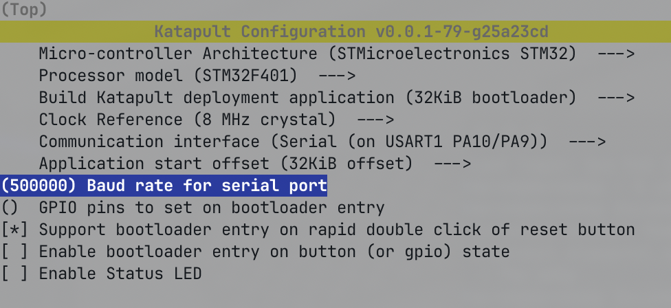

# Qidi Plus 4 Mainline (vanilla) Klipper/Kalico Guide

#  !!! DANGER - WARNING !!! 
This is a work in progress. Do not use any of these configs or instructions unless you know what you're doing!
These modifications are for experienced users. If you are not comfortable with a command line, linux, and electronics, please stop here!

# Introduction
Flashing mainline klipper/kalico on the Qidi Plus4 is relatively easy but does require some effort to flash the toolhead board. You will need an ST-Link programmer or clone to flash the toolhead.

# Backup
Before proceeding, backup any and all data in your printer configs, particularly your `printer.cfg`, `gcode_macros.cfg` and any other files
you may want to save. This can be done via the fluidd interface.


# Flashing the host with an updated Armbian image
## Tools required:
* USB EMMC reader such as [this one](https://www.amazon.com/Vacatga-Adapter-EMMC-Adapter-52-6x16x10mm-2-07x0-63x0-39in/dp/B0D1MY7943?gQT=1)
* A spare eMMC card (optional but recommended) if you want to preserve the original stock card

## Flashing Steps
1. Power down your printer and remove the eMMC card from the printer motherboard. It is held down with 2 screws.
2. Download the latest armbian image from [here](https://github.com/frap129/armbian_qidi-q1-pro/releases).
As of this writing, the file is `Armbian-unofficial_24.2.0_Qidi-q1_bookworm_current_6.6.34.img.xz`
3. Write the image to your eMMC card via your preferred method (Balena Etcher, dd, etc)

    ### If you need wireless networking
    1. After writing the image to your eMMC card, open your file manager and open the `armbi_boot` drive.
    2. Rename the file `armbian_first_run.txt.template` to `armbian_first_run.txt`
    3. Open the file in a text editor, and add the SSID and Password for your wifi network. Find the line for enabling wifi and change 0 to 1.
        * `FR_net_change_defaults=1`
        * `FR_net_wifi_enabled=1`
        * `FR_net_wifi_ssid='MySSID'`
        * `FR_net_wifi_key='MyWiFiKEY'`
4. Unmount the eMMC card and re-install it into your printer and power on. If everything worked, you should now be able to access your printer via SSH.
5. SSH into your printer. The default username/password is `mks`. You will be asked to change your password on first login
6. Install updates
    Lets make sure our system is up-to-date with the latest software. Note that this should NOT change your kernel.
    ```
    sudo apt update && sudo apt upgrade
    sudo apt install git -y
    ```

### Disable debug console
By default, the Plus4 uses `/dev/ttyS2` to communicate with the toolhead. The fresh armbian image you just flashed uses `/dev/ttyS2` as a
kernel debug console, so we need to disable that:
```
echo 'console=none' > sudo tee -a /boot/armbianEnv.txt

# Grant user permissions and prevent getty from taking over the port
echo 'KERNEL=="ttyS2",MODE="0660"' > /etc/udev/rules.d/99-ttyS2.rules
systemctl mask serial-getty@ttyS2.service
```
For more information on these changes, see here: https://github.com/frap129/armbian_qidi-q1-pro#disable-debug-console-uart2--or-freeup-uart1-interface

## Installing klipper/kalico, moonraker, fluidd/mainsail and friends
Now that we have a clean, fresh system, we can start installing the software needed to run the printer. If you want to do this manually, you certainly can.
For everyone else, I recommend installing KIAUH
## Installing KIAUH
KIAUH is a helper script to install klipper/kalico, mainsail, fluidd, crowsnest, moonraker, and many other things you may need or want.
The following steps will get KIAUH installed:
```
  cd ~
  git clone https://github.com/dw-0/kiauh.git
  ./kiauh/kiauh.sh
```
You will now be entered into the KIAUH main menu where you can install the software needed. At a minium install
* Klipper (or Kalico)
* moonraker
* fluidd (or mainsail)

KIAUH should automatically install all the required modules and start the services for you.

After everything is installed, we can move our backed up configurations over to the new setup:
Copy your `printer.cfg` and `gcode_macros` to `~/printer_data/config`

# Flashing the main MCU
Pick your poison - the easier way is to just install klipper. The other option is to install katapult to make flashing Klipper slightly easier in the future.

## If you want Katapult and Klipper

This method installs katapult. With katapult, future flashes of klipper or kalico will only require double clicking the reset button on the
board instead of having to transfer microSD cards back and forth.

## Flashing Katapult

1. SSH into your printer
2. Download Katapult and configure for the main board:
    ```
    cd ~/
    git clone https://github.com/Arksine/katapult
    cd katapult
    make menuconfig
    ```
    Once you are in `make menuconfig`, you want to build katapult with the following options:
    

    After you are sure your menuconfig matches the above settings, you can quit menuconfig (press q then y to save)
3. run `make -j4` to build katapult
4. Copy `~/katapult/out/katapult.bin` to your computer via your favorite method (scp, sftp, or using the fluidd interface)
5. On your computer, format the microSD card as FAT32
6. Copy the `katapult.bin` file to the microSD card and rename it `qd_mcu.bin`
7. Eject the microSD card and plug it into the microSD card slot on the printer.
8. Once the card is inserted, find the button labeled "RESET" on the main board and press it
9. Wait 30-60 seconds
10. Eject the microSD card. Katapult should now be flashed to the main MCU.

## Flashing Klipper on the main MCU

1. SSH into your printer
2. Execute the following to build Klipper
    ```
    cd ~/klipper
    make menuconfig
    ```
    Configure the make arguments in `menuconfig` to match these settings:
    

3. Save and quit by pressing `q` then `y` to save
4. Build klipper by running `make clean; make -j4`
5. Prepare to flash. Double-click the "RESET" button on the board to load katapult. The button must be pressed twice withing 500ms
6. Flash via katapult by doing the following:
    ```
    cd ~/katapult/scripts
    python3 flashtool.py -b 500000 -d /dev/ttyS0 -f ~/klipper/out/klipper.bin
    ```
    You should see output similar to the following if the flash worked:
    

7. Klipper is now flashed to the main MCU. We can now move on to the toolhead.

# Flashing the toolhead
The toolhead takes quite a bit more work to flash. You will need to solder some pins on the board and you will also need an ST-Link programmer (or clone).
The official ST-LINK programmer is what I used. You can purchase one from Digikey (or any other source). [This is the one I used](https://www.digikey.com/en/products/detail/stmicroelectronics/ST-LINK-V2/2214535)

## Preparing the toolhead
Begin by unsliding the back cover of the toolhead, disconnecting all connectors, and unscrewing the board from the toolhead.

Next, you need to solder a 6 pin header on the board like the below image:


Once the header is soldered, we need to wire it to the ST-LINK:

Use the following wiring diagram


```
This image courtesy @transmutated
+-------- J1 6-Pin Connector --------+            +---------- STLink V2 20-Pin Connector -----------+
|                                    |            |                                                 |
| Pin 1: DIO   ----------------------|------------| Pin 7: SWDIO / TMS7                             |
| Pin 3: CLK   ----------------------|------------| Pin 9: SWCLK / TCK9                             |
| Pin 5: RST   ----------------------|------------| Pin 15: MCU RST                                 |
| Pin 6: GND   ----------------------|------------| Pin 12: GND                                     |
| Pin 4: GND                         |            |                                                 |
| Pin 2: 3V3   ----------------------|---+--------| Pin 1: VDD                                      |
|                                    |   |        |                                                 |
|                                    |   |--------| Pin 19: VDD                                     |
+------------------------------------+            +-------------------------------------------------+
```

---
## Other References and Resources
- references from @transmutated - most likely the first person to flash the toolhead successfully: https://github.com/cgarwood82/plus4MainlineKlipperConfig/tree/main
- Open Q1 repo - the Q1 Pro uses the same main board as the plus4: https://github.com/frap129/OpenQ1/tree/main
